# Project Data Lake

## Project Description
A music streaming startup, Sparkify, has grown their user base and song database even more and want to move their data warehouse to a data lake. Their data resides in S3, in a directory of JSON logs on user activity on the app, as well as a directory with JSON metadata on the songs in their app.

This project builds the ETL pipeline that extracts this data from S3, processes them using Spark, and loads the data back into S3 as a set of dimensional tables.

This will allow the analytics team to continue finding insights into their data.

## Project Datasets
Song Dataset and Log Datasets are available in S3 bucket

Song Dataset - `s3://udacity-dend/song_data`

Log Data - `s3://udacity-dend/log_data`

Both these datasets are in the jSON format.

Song Dataset - Is a subset of real data from the Million Song Dataset. Each file contains metadata about song and the artist for that song. The files are partitionefd by the first 3 letters of each song's track ID. For example, here are 2 filepaths to 2 files in this dataset

song_data/A/B/C/TRABCEI128F424C983.json
song_data/A/A/B/TRAABJL12903CDCF1A.json

Sample data from the song dataset

```
{"num_songs": 1, "artist_id": "ARJIE2Y1187B994AB7", "artist_latitude": null, "artist_longitude": null, "artist_location": "", "artist_name": "Line Renaud", "song_id": "SOUPIRU12A6D4FA1E1", "title": "Der Kleine Dompfaff", "duration": 152.92036, "year": 0}
```

Log Dataset - These are log files in JSON format generated by an event simulator based on the songs in the song dataset. These simulate app activity logs from the sparkify music streaming app based on configuration settings.

The log files in the dataset are partitioned by year and month. For example, here are 2 filepaths to 2 files in this dataset.

log_data/2018/11/2018-11-12-events.json 

log_data/2018/11/2018-11-13-events.json

Sample data from this file
    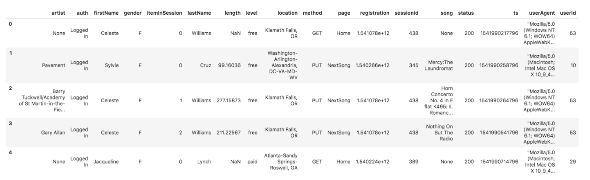


## Tables Created
|  Name | Type  | Description  | Columns  |  Partition Columns|  
|-------|-------|--------------|----------|------------------|
| users |  dimension table |users in the app   |  user_id,first_name,last_name,gender,level ||   
| songs |  dimension table |songs in the music database    | song_id, title, artist_id, year,duration | year, artist|  
| artists  | dimension table  | artists in the music database  | artist_id, name, location, latitude, longitude  ||   
| time |  dimension table |timestamps   |  start_time, hour, day, week, month, year, weekday |  year,month|
| songplay |  fact table | records in log data associated withj song plays i.e records with page `NextSong`  |  songplay_id,start_time,user_id,level,song_id,artist_id,session_id,location,user_agent| year,month|

## Star Schema 
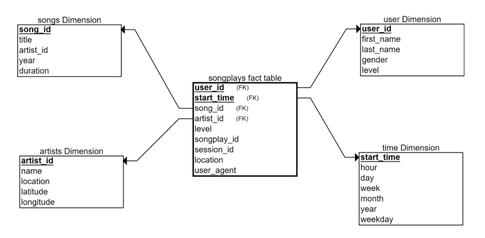

### ETL Process
The ETL pipeline loads the S3 data sources into Spark dataframes, aggregates and transforms the data into the above schema structure and writes this data back into S3 parquet format.

### How to run the python code
1. First create an IAM user with necessary rights to read and write to S3 bucket.
2. Enter these credentials in the `dl.cfg` file
3. Create a S3 bucket and enter the URL of the bucket in the `etl.py` output_data value.
4. Run `python etl.py` to read and process the files and load it back into the S3 bucket.
5. Run test.ipynb to query the content of the S3 bucket.
    
   
### Output in S3 bucket
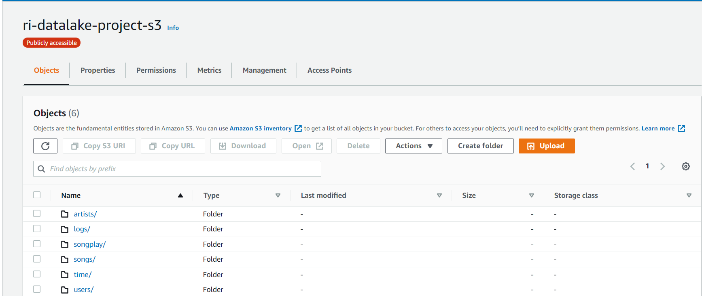

#### Songs
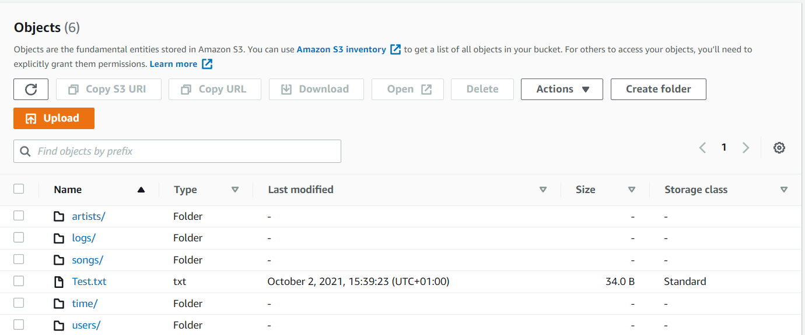

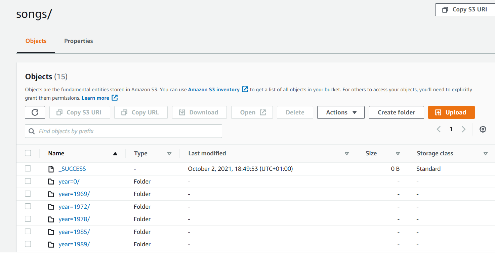

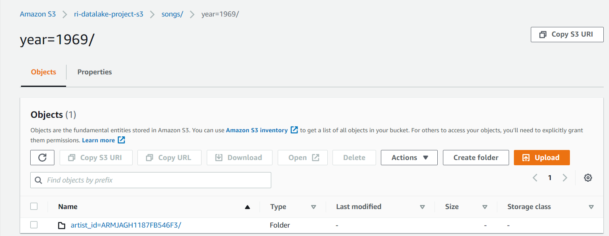

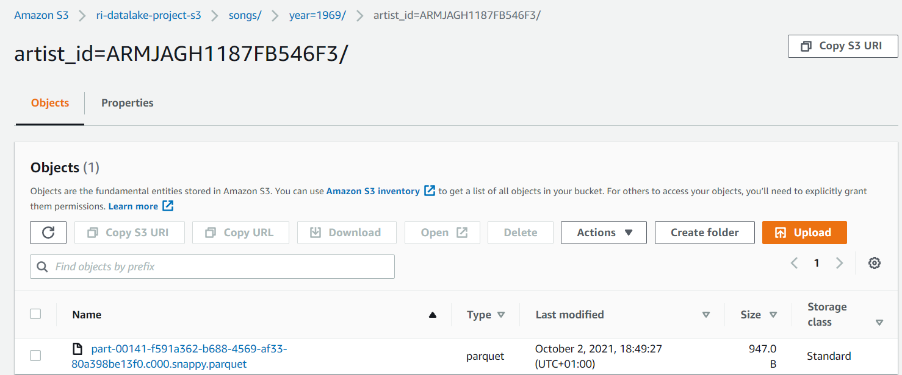

#### Users
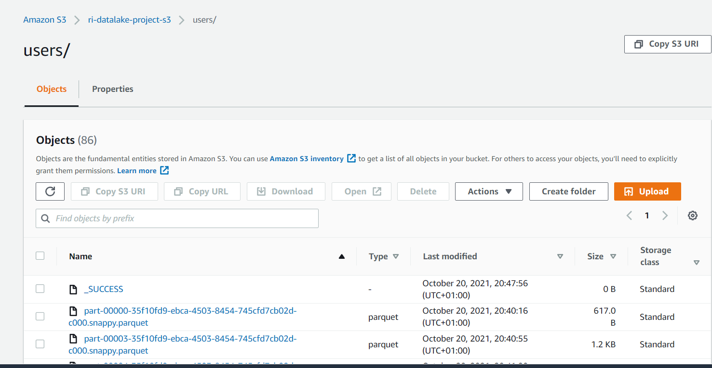

#### Time
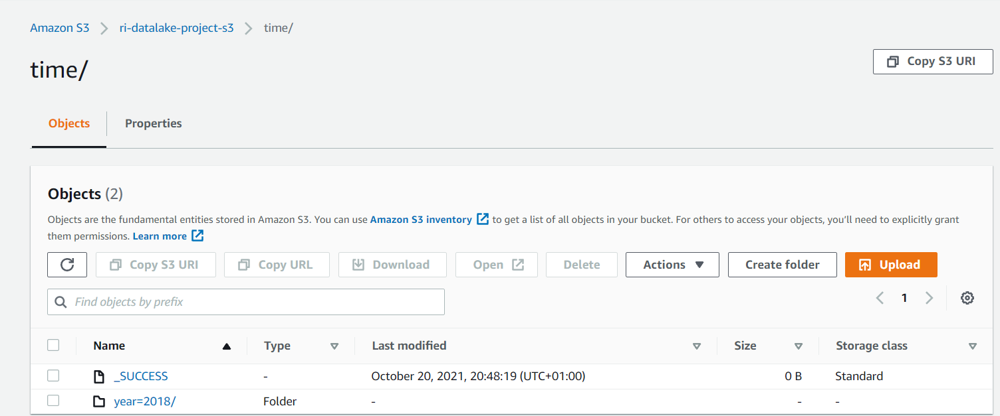
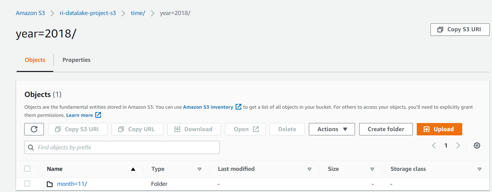
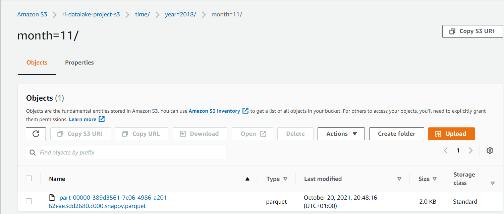

#### Songplay table
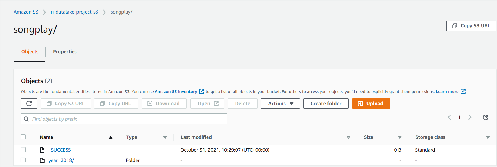

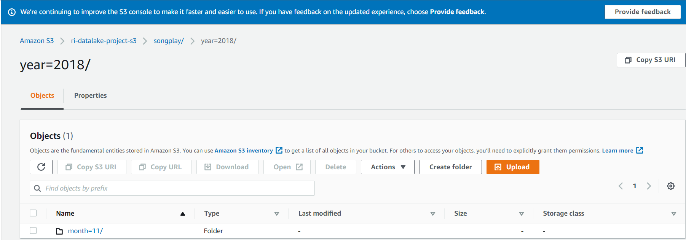

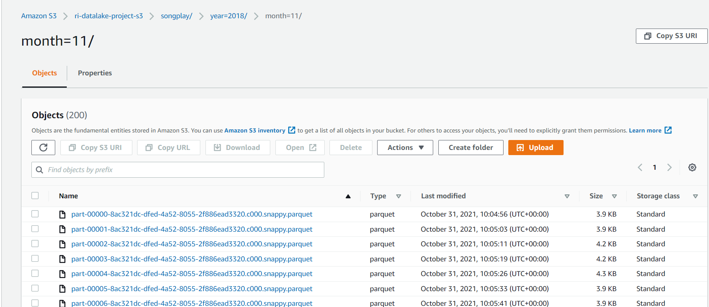
### Summary
This project demonstrates how we can build a simple data lake using Spark and S3.